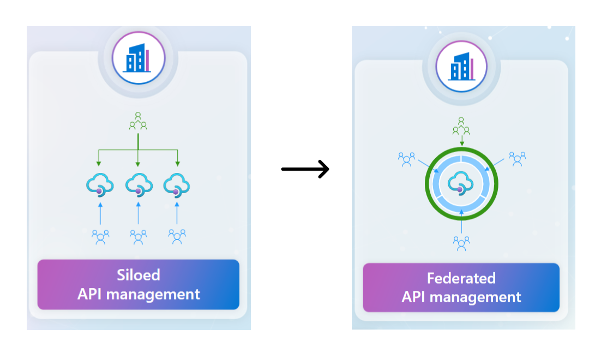

# Project - Migration of Multiple Siloed APIM Instances to a Federated Workspace-Based APIM  

The goal of this project is to support the migration of multiple siloed API Management (APIM) instances into a single, workspace-based federated APIM instance. This capability aims to streamline operations, enhance management efficiency, and reduce complexity for users managing dispersed APIM environments.



## Workspace Overview 

Workspaces in Azure API Management introduce a new level of autonomy for an organization's API teams, allowing them to create, manage, and publish APIs more efficiently and securely. These workspaces provide isolated administrative access and API runtime, empowering API teams while enabling the central API platform team to maintain oversight through centralized monitoring, API policy enforcement, compliance, and unified API discovery via a developer portal. Functioning like "folders," each workspace contains APIs, products, subscriptions, named values, and related resources, with access managed through Azure's role-based access control (RBAC). Additionally, each workspace is linked to a workspace gateway that routes API traffic to backend services. 

## Benefits to migrate to federated APIM 

Discover the benefits of federated workspaces in Azure API Management and how they enhance autonomy and efficiency for your API teams by reading more on the Microsoft Tech Community blog [Announcing General Availability of Workspaces in Azure API Management - Microsoft Community Hub](https://techcommunity.microsoft.com/t5/azure-integration-services-blog/announcing-general-availability-of-workspaces-in-azure-api/ba-p/4210796)

## Current Limitation  

### Limitation - Not supported at workspace level at the moment

| Siloed APIM                                        | Workspace-based APIM | Workspace Level                          |
| -------------------------------------------------- | -------------------- | ---------------------------------------- |
| APIs- Credential manager/Authorization             | No                   | Not Supported at workspace at the moment |
| Deployment & Infrastructure - Locations            |                      | Not Supported at workspace at the moment |
| Deployment & Infrastructure -Scale Out             |                      | Not Supported at workspace at the moment |
| Deployment & Infrastructure - self hosted gateways |                      | Not Supported at workspace at the moment |
| Managed identities -User assigned                  |                      | Not Supported at workspace at the moment |
| Managed identities - System Assigned               |                      | Not Supported at workspace at the moment |
| Protocols+Ciphers                                  |                      | Not Supported at workspace at the moment |

### Limitation - Guidance to configure for the federated APIM

| Siloed APIM                            | Workspace-based APIM | Workspace Level                           | Migration method (manual / APIOps / FTA scripts)                                |
| -------------------------------------- | -------------------- | ----------------------------------------- | ------------------------------------------------------------------------------- |
| APIs - Schemas                         | Yes                  | APIs - Schemas                            | Manual configuration                                                            |
| Certificate - cert for frontend mtls   |                      | workspace - supported                     | Manual upload(except Azure Key Vault)                                           |
| D&I  - Custom domains                  |                      | Not supported at workspace at the momenet | Configure AppGatewy/AzureFont Door for the custom domain                        |
| D&I- notifications first 2             |                      | workspace - supported                     | Manually configure the emails, Add in the workspace level in the azure portal   |
| D&I  - Notifications - rest            |                      | Not supported at workspace                | By design                                                                       |
| Application Insights  -API             |                      | workspace - supported                     | Manual configuration                                                            |
| Application Insights - Instance        |                      |                                           | Manual configuration                                                            |
| Deplpyment & infrastructure  - Network |                      | workspace - supported                     | Manual configuration.Cannot reuse the same vnet but same config can be applied. |

### Out of scope items for this tool

| Siloed APIM                        | Workspace-based APIM | Workspace Level              | Migration method (manual / APIOps / FTA scripts) |
| ---------------------------------- | -------------------- | ---------------------------- | ------------------------------------------------ |
| Developer Portal - Portal Overview | No                   | Out of scope - at the moment | Out of scope - at the moment                     |
| Developer Portal - Portal Settings |                      | Out of scope - at the moment | Out of scope - at the moment                     |
| Developer Portal - Identities      |                      | Out of scope - at the moment | Out of scope - at the moment                     |
| Developer Portal - Delegation      |                      | Out of scope - at the moment | Out of scope - at the moment                     |
| Developer Portal - oAuh            |                      | Out of scope - at the moment | Out of scope - at the moment                     |


## Features of this project 

Here are some potential features for a project focused on migrating siloed API Management (APIM) instances to a workspace-based federated single APIM instance:

1. Automated Migration Tool: A tool that automates the migration process, ensuring a smooth transition from multiple siloed APIM instances to a unified workspace-based instance.
1. Instance Consolidation: Ability to merge multiple APIM instances into a single, cohesive workspace.
1. Guidance Documentation: Comprehensive documentation and best practices and limitation to assist users throughout the migration process.
1. User Access Management: Centralized management of user roles and permissions within the new workspace-based APIM instance.

## Getting Started

This section provides a concise overview for getting started with the project, ensuring users have the necessary tools and permissions, and guiding them through the initial setup and configuration steps.

### Prerequisites

1. [Install Azure PowerShell](https://learn.microsoft.com/en-us/powershell/azure/install-azure-powershell?view=azps-12.3.0#install)
1. [Install WSL](https://learn.microsoft.com/en-us/windows/wsl/install#install-wsl-command)
1. [Install Azure CLI](https://learn.microsoft.com/en-us/cli/azure/install-azure-cli#install)
1. Azure Subscription Access - Ensure you have an active Azure account with contributor access to manage APIM instances.


### Installation

1. Open WSL

2. Create a folder for the migration activity.

```azurecli
mkdir apim-silo-to-federated
cd apim-silo-to-federated 
```

3. Clone the tools repository

```azurecli
git clone  https://github.com/Azure-Samples/api-management-workspaces-migration
```

#### Setup APIOps for the federated instance

4. Following the gudiance in APIOPS doc,,create a repository `federated-apim-apiops` to enable APIOPs for the migration to federated apim instance from siloed apim instance

5. Setup APIOps for the migration thorugh APIOps

 Configure APIM tools for [Azure DevOps](https://azure.github.io/apiops/apiops/3-apimTools/apimtools-azdo-2-3-new.html) or [GitHub](https://azure.github.io/apiops/apiops/3-apimTools/apimtools-github-2-4-new.html). Use the APIOps release[v6.0.2-alpha.1.0.3 or higher ](https://github.com/Azure/apiops/releases)

6. Setup Extractor pipeline for the each siloed instance using Azure DevOps or GitHub


7. Run the extractor pipeline for each Siloed instances (for multiple siloed instances, run the extractor pipeline multiple times to get the artifacts in different folders.
   Mention the folder name where you want to extract the artifacts in the pipeline e.g. silo001 , silo002 etc. 

8. Clone the `federated-apim-apiops` repository under the root folder `apim-silo-to-federated`

```azurecli
git clone <repository_url>   
```

9. Change the variables in .\ api-management-workspaces-migration\create-workspace.ps1 script 

#### Define source and destination directories and workspace names   

```azurepowershell
$srcDir1 = ".\federated-apim-apiops\silo001"
$srcDir2 = ".\federated-apim-apiops\silo002"
$destDir = ".\federated-apim-apiops\artifacts-workspace"
$newWorkspace1 = "<name of the workspace1>"
$newWorkspace2 = "<name of the workspace2>"
```

10. Run the shell scripts to merge siloed artifacts with a workspace folder structure -   -  

```azurepowershell
PS> .\api-management-workspaces-migration \create-workspace.ps1  
```

11. Go to the  <<federated-apim-apiops>>  folder

```azurecli
cd federated-apim-apiops 
```

12. Push the `artifacts-workspace` workspace folder to  `federated-apim-apiops` repository

```azurecli
git push << federated-apim-apiops >>
```

13. Setup the APIOps publisher pipeline from `federated-apim-apiops` repository targets to `atrifacts-workspace` folder.

14. Get the access token

 
```azurecli
ACCESS_TOKEN=$(az account get-access-token --resource=https://management.azure.com --query accessToken --output tsv)   
echo "Access Token: $ACCESS_TOKEN"   
```
 

 
15. Change the variables in the scripts in 'api-management-workspaces-migration' folder -  

#### Define your subscriptionId, resourceGroupName, and serviceName  for your siloed APIM instance 

```azurepowershell
$siloAPIMsubscriptionId = ""  # Replace with your actual subscriptionId
$siloAPIMresourceGroupName = ""  # Replace with your actual resourceGroupName 
$siloAPIMserviceName = "" # Replace with your actual serviceName
$siloAPIMapiVersion = "2023-09-01-preview"  
```
  

#### Define your subscriptionId, resourceGroupName, and serviceName  for your federated APIM instance 

```azurepowershell
$federatedAPIMsubscriptionId = ""  # Replace with your actual subscriptionId
$federatedAPIMresourceGroupName = ""  # Replace with your actual resourceGroupName
$federatedAPIMserviceName = "" # Replace with your actual serviceName
$federatedAPIMapiVersion = "2023-09-01-preview"  
```
  

#### Get the access token  

```azurepowershell
$siloAPIMaccessToken = "" # Replace with your actual token
$federatedAPIMaccessToken = ""  # Replace with your actual token
```

16. Run the shell scripts to migrate the entities through scripts.
 
```azurepowershell
PS> cd  .\apim-federrated-to-siloed 
PS> .\api-management-workspaces-migration\create-users.ps1 
PS> .\api-management-workspaces-migration\create-groups-and-groupusers.ps1 
PS> .\api-management-workspaces-migration\create-subscriptions.ps1
```

17. Run step #15 and #16 for each siloed instances. 

18. Complete the manual configuration on federated instances outlined above table. 


 
### Entities Migration through APIOps
 
| Siloed APIM              | Workspace-based APIM | Workspace Level          | Migration method (manual / APIOps / FTA scripts) |
| ------------------------ | -------------------- | ------------------------ | ------------------------------------------------ |
| APIs - APIs              | Yes                  | Workspace - APIs         | APIOps                                           |
| APIs - Products          |                      | APIs - Products          | APIOps                                           |
| APIs - Named values      |                      | APIs - Named values      | APIOps                                           |
| APIs - Backends          |                      | APIs - Backends          | APIOps                                           |
| APIs - Policy fragemnts  |                      | APIs - Policy fragemnts  | APIOps                                           |
| APIs- API Tags           |                      | APIs- API Tags           | APIOps                                           |
| APIs - Policy (all APIs) |                      | APIs - Policy (all APIs) | APIOps                                           |
| Custom Loggers           |                      | Supported                | APIOps                                           |


### Entities Migration through Scripts

| Siloed APIM                     | Workspace-based APIM | Workspace Level                | Migration method (manual / APIOps / FTA scripts) |
| ------------------------------- | -------------------- | ------------------------------ | ------------------------------------------------ |
| Developer Portal - Users        | Yes                  | Developer Portal - Users       | [Powershell Script](create-users.ps1)                             |
| Developer Portal - User Groups  |                      | Developer Portal - User Groups | [Powershell Script](create-groups-and-groupusers.ps1)                             |
| APIs - Subscriptions(with Keys) |                      | APIs - Subscriptions           | [Powershell Script](create-subscriptions.ps1)                             |


## Contributing

This project welcomes contributions and suggestions. Most contributions require you to agree to a Contributor License Agreement (CLA) declaring that you have the right to, and actually do, grant us the rights to use your contribution. For details, visit https://cla.opensource.microsoft.com.

When you submit a pull request, a CLA bot will automatically determine whether you need to provide a CLA and decorate the PR appropriately (e.g., status check, comment). Simply follow the instructions provided by the bot. You will only need to do this once across all repos using our CLA.

This project has adopted the Microsoft Open Source Code of Conduct. For more information see the Code of Conduct FAQ or contact opencode@microsoft.com with any additional questions or comments.

## Trademark

This project may contain trademarks or logos for projects, products, or services. Authorized use of Microsoft trademarks or logos is subject to and must follow Microsoft's Trademark & Brand Guidelines. Use of Microsoft trademarks or logos in modified versions of this project must not cause confusion or imply Microsoft sponsorship. Any use of third-party trademarks or logos are subject to those third-party's policies.